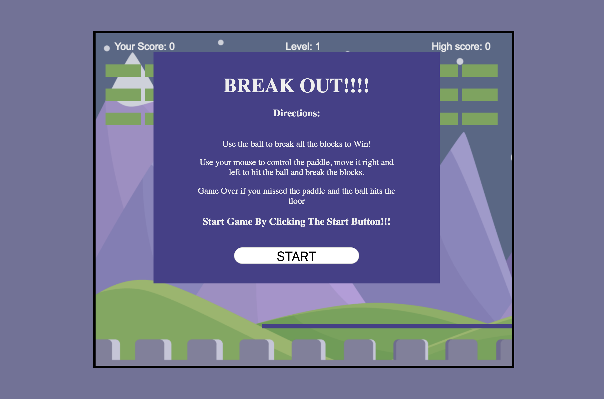
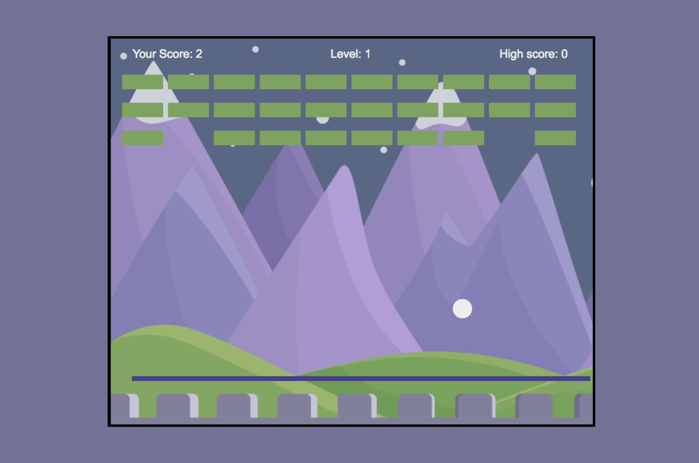

# Game Time

## Group: [Ngoc Phan](https://github.com/nphan24) and [Sabrina Kennedy](https://github.com/skenne21)
#### [Game Live](http://skenne21-game-time.surge.sh/)

## Description

This project served as practice with getting a solid understanding of HTML Canvas and ES6 Javascript classes. As non-lifetime gamers My partner and I wanted to create a game that was visually exciting for the user and was easy to play for any user.  We created the classic game breakout which allows users to advance to different levels which get progressively harder with a smaller ball size and increasing the velocity and speed as the game advances in levels.

[Original Specs to Project](http://frontend.turing.io/projects/game-time.html)

## Set Up

Clone this project

Run `npm install` from the root directory

Run `npm start`

You can run the testing suite with `npm test`.

## Future

We see making this game have more levels in the future and making bonus features such as when the blocks are broken they drop to balls or give the user more lives. 

## Screenshot
;

